# Hackable3靶机

## 信息搜集

1. 使用`arp-scan -l`扫描网段下存活的ip，找到目标靶机的ip地址。


2. 用nmap扫描目标靶机开放的端口,目标开放了22端口和80端口。

   ```
   nmap -p- 192.168.1.10
   ```

   

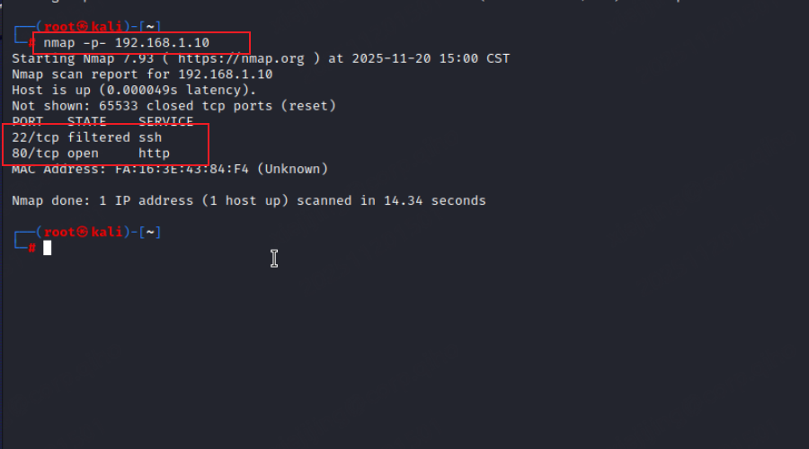

3. 访问80端口进入主页，查看源代码发现提示。得到登录页面地址和用户。

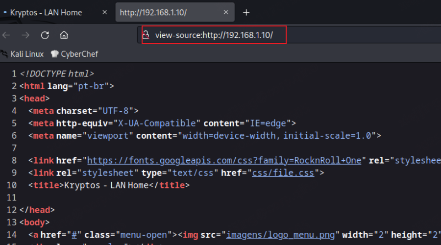

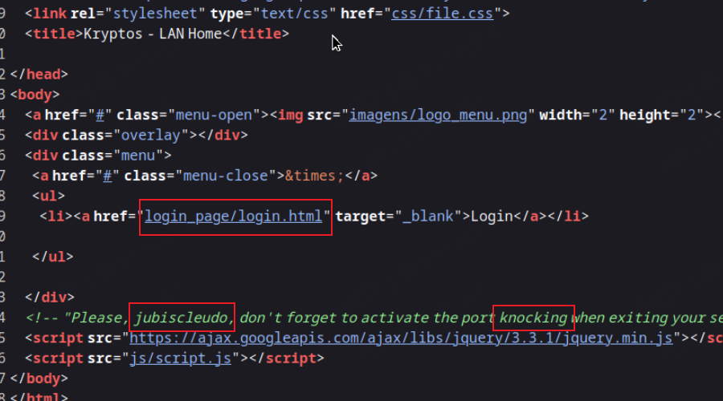

```
Please, jubiscleudo, don't forget to activate the port knocking when exiting your section, and tell the boss not to forget to approve the .jpg file - dev_suport@hackable3.com" 
```

4. 使用dirsearch工具扫描目录

   ```
   dirsearch -u http://192.168.1.10/ -i 200
   ```

   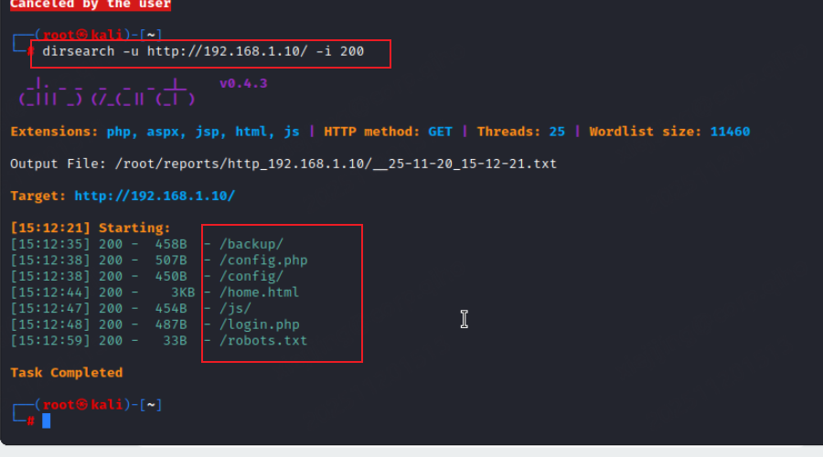

5. 访问/config页面，查看1.txt文件。得到一串base64编码。

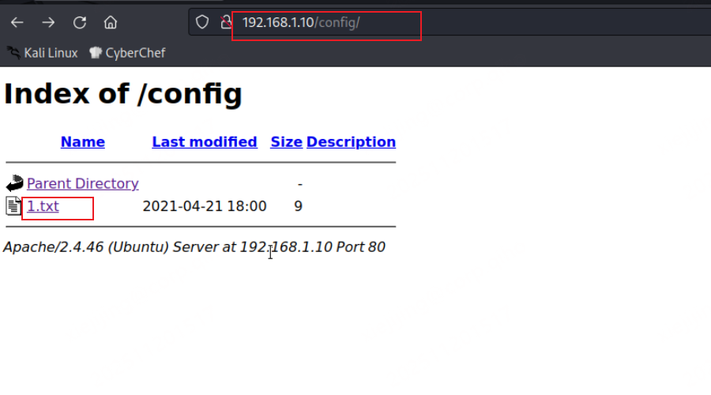

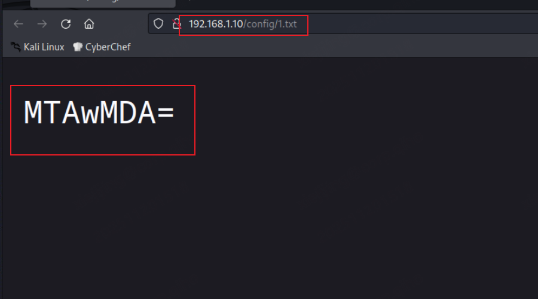

6. 在[Base64编码解码](https://base64.us/)这个网站进行解码，得到敲门端口**10000**

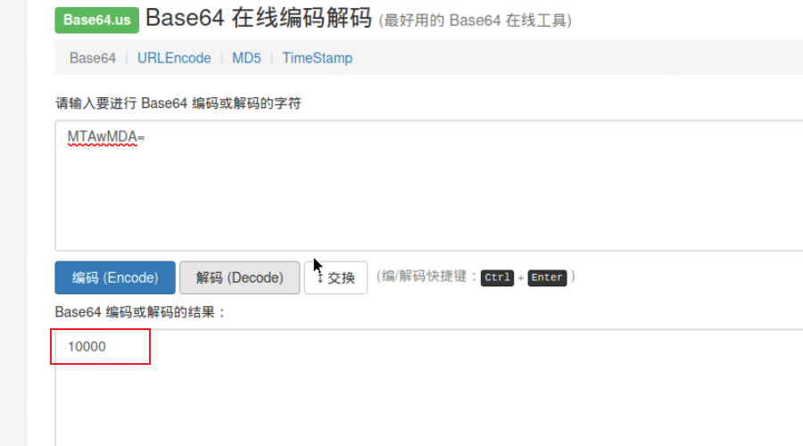

7. 访问login.php,查看源码。查看3.jpg。

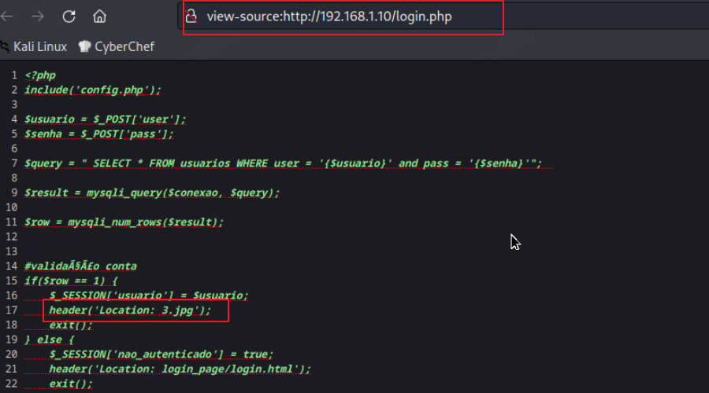

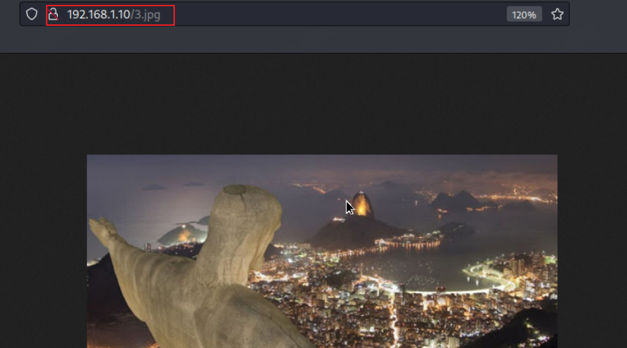

8. 将图片下载到本地

   ```
   wget http://192.168.1.10/3.jpg
   ```

   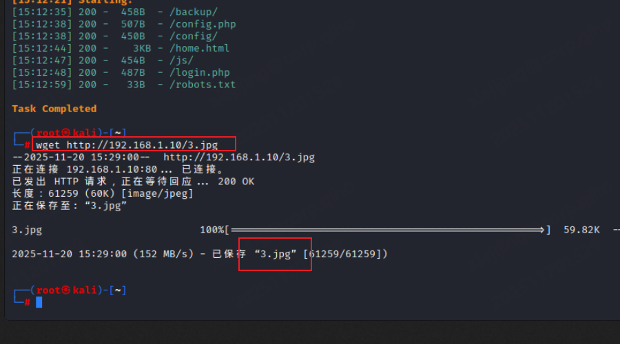

9. 使用steghide工具查看图片是否存在隐写,查看结果文件发现**65535**端口

   ```
   steghide extract -sf 3.jpg
   ```

   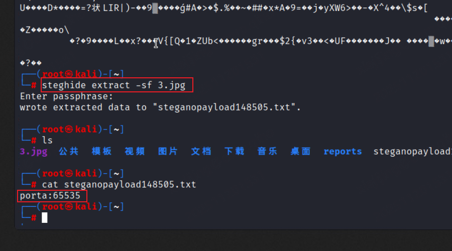

10. 访问css目录发现存在2.txt文件，点击查看得到一串BrainFuck编码。

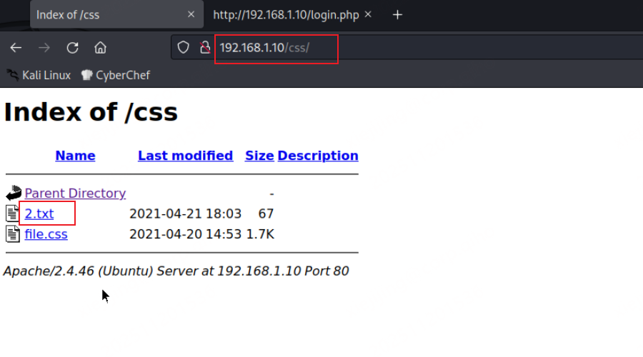

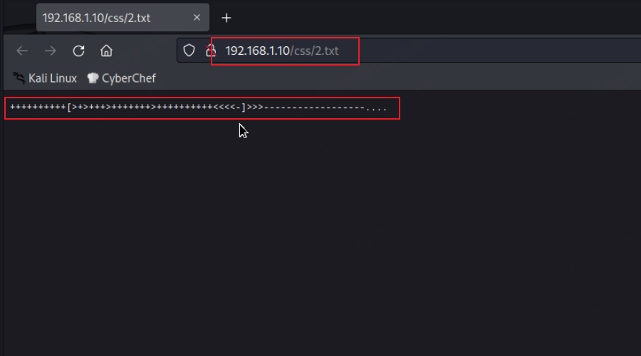

11. 在[Brainfuck/OoK加密解密 - Bugku CTF平台](https://ctf.bugku.com/tool/brainfuck/)进行解码。得到**4444**端口

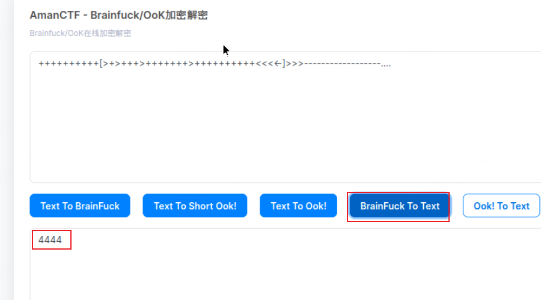

12. 访问backup目录查看wordlist.txt文件，发现很多密码。将文件下载到本地

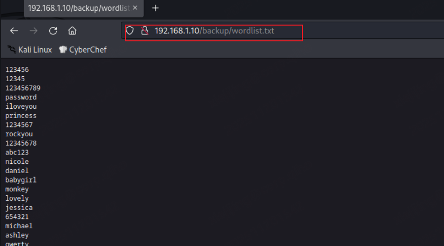

```
wget http://192.168.1.10/backup/wordlist.txt
```

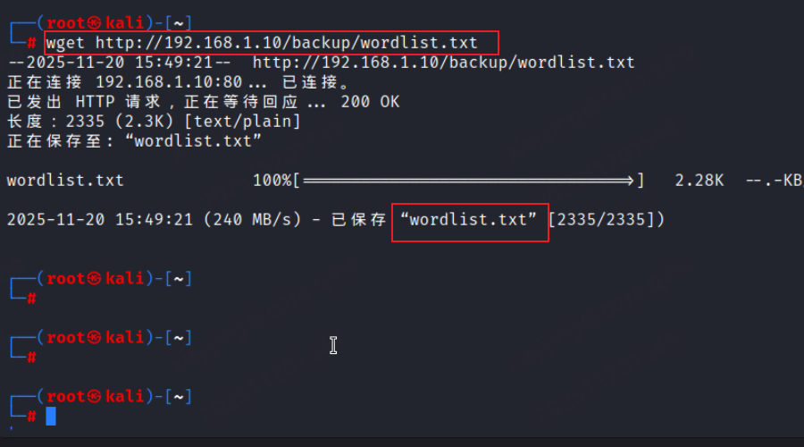

13. 

